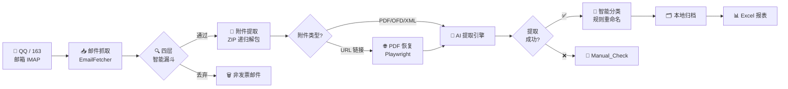
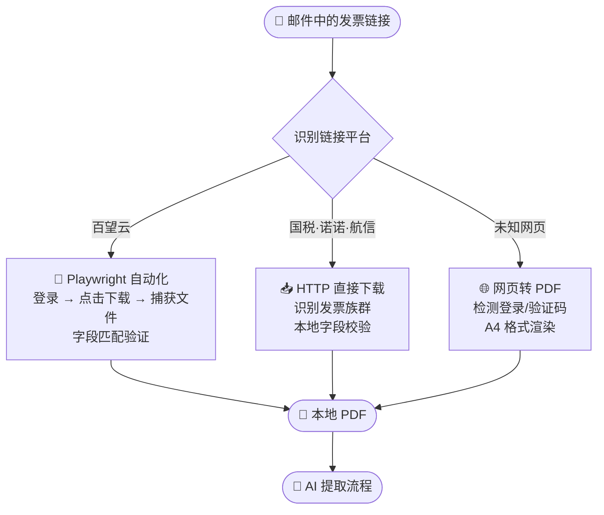

# InvoiceFlowAI — 电子发票整理与报销准备工具

<div align="center">

[English](README.en.md) | **中文**

</div>


<div align="center">


**把邮箱中的 PDF、OFD、XML 电子发票和部分发票下载链接，整理成分类文件与 Excel 报销汇总。**

面向每月需要手工收集多张电子发票的个人、自由职业者和小团队。连接自己的 QQ 或 163 邮箱后，可批量收集发票、OCR 识别、分类归档并生成汇总；低置信度结果保留给用户人工检查。

下载：[最新 Windows x64 安装版与免安装版](https://github.com/EthanYoQ/Invoice-Downloader/releases/latest)

*邮件和发票文件在本地处理。启用 GLM OCR / 视觉识别时，发票图片会发送到你配置的模型服务商用于提取。*

</div>

<p align="center">
  
</p>

---

## ✨ 核心亮点

| &nbsp; | 特性 | 说明 |
|--------|------|------|
| 🔒 | **一键运行，开箱即用** | 解压即可运行，无需安装 Python 或任何依赖 |
| 🤖 | **双引擎 AI 识别** | Track A（OCR精确流）+ Track B（视觉降级流），自动切换，无需手动操作 |
| 🔍 | **四层智能漏斗** | 白名单域名 → 主题关键字 → 正文检测 → 二维码扫描，精准过滤非发票邮件 |
| 📄 | **链接发票自动恢复** | Playwright 自动打开百望云、税务平台链接，下载正式 PDF 存档 |
| 🧾 | **发票与凭证自动撮合** | 住宿发票/水单、打车发票/行程单自动配对并相邻命名归档 |
| 🪟 | **安静的后台处理** | URL 恢复 worker、Node 与 Chromium 全链路隐藏运行，不再批量弹出控制台窗口 |
| 🗂️ | **自然语言分类规则** | 支持"滴滴大于100元放进大额"这样的自定义规则 |
| 📊 | **一键 Excel 报表** | 自动生成 `summary_report.xlsx`，发票清单、金额汇总全覆盖 |

---

## 🏗️ 整体工作流程



---

## 🤖 双引擎 AI 提取架构

系统采用 **Track A + Track B + Local Fallback** 三层防线，任何一层成功即采用结果，确保极高的识别成功率。


> **为什么这样设计？**
> - **Track A**（OCR + LLM）：精度最高，先提取文字结构再理解
> - **Track B**（glm-4.5V 视觉）：直接"看图"，适合复杂排版或图片类发票
> - **Local Fallback**：本地正则规则，断网可用，零 API 消耗

---

## 🔍 四层智能筛选漏斗

系统不会对每封邮件都调用 AI，而是先经过四层漏斗精准判断，大幅降低误识别率和 API 费用。


筛选通过后，附件还会经过 **三级决策**：

| 层级 | 触发条件 | 处理方式 |
|------|----------|----------|
| 🗑️ **A 层**（丢弃） | Tracking pixel、Logo、装饰图（≤32px） | 直接跳过 |
| 📦 **B 层**（暂存） | 附件 >5MB、ZIP 解包失败 | 保留但不处理 |
| ✅ **C 层**（归档） | 正常 PDF/OFD/XML | 进入 AI 提取流程 |

---

## 🌐 三级 PDF 恢复方案

许多发票邮件只有"点击下载"的链接，系统自动识别平台并选择最优方案：



---

## ⚙️ 配置指南

> 首次使用只需配置一次，之后每次扫描直接点击运行。

### 第一步 · 开启 163 邮箱 IMAP

<details>
<summary>📖 点击展开 163 邮箱详细步骤</summary>

**服务器参数**

| 参数 | 值 |
|------|----|
| IMAP 服务器 | `imap.163.com` |
| 端口 | `993`（SSL/TLS） |

**开启步骤**

1. 登录 [mail.163.com](https://mail.163.com)，点击右上角「**设置**」
2. 在下拉菜单中选择「**POP3/SMTP/IMAP**」
3. 找到「**IMAP/SMTP 服务**」，点击右侧「**开启**」按钮
4. 弹出「账号安全验证」窗口：
   - **扫码方式**（推荐）：手机扫描二维码，自动发送验证短信
   - **手动方式**：按提示手动发送短信到指定号码
5. 短信发送后点击「**我已发送**」
6. 系统生成 **16 位授权码**（字母组合，**仅显示一次，务必立即复制保存**）

> ⚠️ 授权码不是邮箱登录密码，是专用于第三方客户端的独立密码，大小写敏感。

📚 [163 邮箱官方帮助](https://help.mail.163.com/)

</details>

---

### 第二步 · 开启 QQ 邮箱 IMAP

<details>
<summary>📖 点击展开 QQ 邮箱详细步骤</summary>

**服务器参数**

| 参数 | 值 |
|------|----|
| IMAP 服务器 | `imap.qq.com` |
| 端口 | `993`（SSL/TLS） |

**开启步骤**

1. 登录 [mail.qq.com](https://mail.qq.com)，点击右上角「**设置**」图标
2. 选择「**账户**」选项卡
3. 找到「**POP3/IMAP/SMTP/Exchange/CardDAV/CalDAV 服务**」
4. 点击「**管理服务**」→「**开启服务**」
5. 点击「**生成授权码**」，进行身份验证：
   - **扫码方式**（推荐）：手机扫码后自动发送验证短信
   - **手动方式**：用 QQ 绑定手机发送「**配置邮件客户端**」到 **1069070069**
6. 点击「**我已发送**」，验证后授权码即时生成（**请立即保存**）

> ⚠️ 修改 QQ 密码后授权码自动失效，需重新生成。

📚 [QQ 邮箱官方帮助](https://service.mail.qq.com/detail/0/339)

</details>

---

### 第三步 · 获取 DeepSeek API Key

<details>
<summary>📖 点击展开 DeepSeek API 配置步骤</summary>

桌面版设置界面需要填写 **DeepSeek API Key**。API 用量和费用以 DeepSeek 平台显示为准。

**步骤**

1. 访问 [DeepSeek 开放平台](https://platform.deepseek.com/)，注册并登录
2. 打开 **API Keys** 页面，创建 API Key
3. 复制并妥善保存 Key，在首次启动的设置界面中填写

📚 [DeepSeek API Keys](https://platform.deepseek.com/api_keys)

</details>

---

## 🚀 快速开始

### Windows（安装版 / 免安装版）

1. 安装版：运行 `InvoiceFlowAI-*-windows-x64-setup.msi`；免安装版：解压 `InvoiceFlowAI-*-windows-x64-portable.zip` 到普通文件夹（避免云盘同步目录），保留压缩包中的目录结构。
2. 双击 `InvoiceFlowAI.exe`；首次启动会自动弹出设置界面。
3. 填入邮箱地址与授权码（QQ 或 163）、DeepSeek API Key，保存后点击「开始扫描」。发票会自动归档到桌面「发票整理」文件夹。

---

## 📁 输出目录结构

```
发票整理/
├── 火车票/
│   └── 20260315-北京-上海-火车票.pdf
├── 机票/
│   └── 20260301_机票_1280.00_中国国际航空.pdf
├── 住宿发票/
│   ├── 20260310-住宿-01-发票_888.00元.pdf
│   └── 20260310-住宿-01-水单_888.00元.pdf
├── 打车/
│   ├── 0312-滴滴-01-发票_45.50元.pdf
│   └── 0312-滴滴-01-行程单_45.50元.pdf
├── 餐饮/
├── 待人工复核/        ← 无法可靠确认的材料，需人工处理
├── 非目标公司发票/
└── summary_report.xlsx
```

---

## ❓ 常见问题

<details>
<summary>Q：软件启动后白屏或无响应？</summary>

- 确认已将**整个压缩包解压**，`_internal` 文件夹须与 `InvoiceFlowAI.exe` 在同一目录
- 避免将软件放在含有**中文路径或空格**的目录下

</details>

<details>
<summary>Q：扫描完发票数量很少？</summary>

- 在软件的时间范围设置中，将起始日期**往前调整至 180 天以上**
- 部分邮箱默认只拉取近30天邮件，需要在邮箱 IMAP 设置里选择「收取全部邮件」

</details>

<details>
<summary>Q：授权码填写后提示认证失败？</summary>

- **QQ 邮箱**：须从「管理服务 → 生成授权码」流程中获取，**不是 QQ 密码**
- **163 邮箱**：须从「开启 IMAP 服务」弹窗中生成，**不是邮箱登录密码**，注意大小写
- QQ 修改密码后需重新生成授权码

</details>

<details>
<summary>Q：DeepSeek API 报错额度不足？</summary>

登录 [DeepSeek 开放平台](https://platform.deepseek.com/) 查看 API 用量、账户余额和可用服务。

</details>

<details>
<summary>Q：部分发票进入 Manual_Check 文件夹？</summary>

正常现象。当 AI 识别置信度不足时，系统自动放入 `Manual_Check` 队列，需人工确认。通常由图片模糊、非标准票据或加密 PDF 导致。

</details>

---

## 🛡️ 隐私与安全

- 所有邮件、发票文件均在**本地处理**，不上传任何服务器
- 邮箱凭据在 Windows 通过 **DPAPI** 加密存储
- GLM API 仅接收**发票图片**（Base64）用于文字识别，不发送邮件原文内容

---

## ⚠️ 免责声明

使用本软件即表示您已理解并接受以下内容。

**合规使用** · 本软件通过 IMAP **只读**访问邮箱，不发送、删除或修改任何邮件。用户须确保对所处理邮箱拥有合法授权。

**用途** · 本软件仅用于发票邮件下载、识别、分类、归档等自动化辅助。

**准确性与合规性** · 作者不保证发票数据或生成结果的准确性、完整性、合法性、税务合规性、财务合规性或会计合规性。用户必须自行核验所有发票、报销、税务、会计和合规结果后再使用。

**数据** · 调用 DeepSeek API 进行发票信息提取时，发票文本和识别提示词会发送至 DeepSeek；启用视觉回退时，相关发票页面图像也会发送。邮件原文不会发送。详情请参阅 [DeepSeek 隐私政策](https://cdn.deepseek.com/policies/zh-CN/deepseek-privacy-policy.html)。

**责任限制** · 作者不对使用本软件造成的损失、遗漏、错误、报销失败、税务风险、合规问题或数据丢失承担责任。

**第三方服务**

| 服务 | 用途 | 服务方 |
|------|------|--------|
| DeepSeek API | 发票 OCR 与视觉识别 | DeepSeek |
| QQ 邮箱 IMAP | 邮件读取 | 腾讯科技（深圳）有限公司 |
| 163 邮箱 IMAP | 邮件读取 | 网易（杭州）网络有限公司 |

---

## 📜 许可证

本项目基于 [Apache License 2.0](LICENSE) 授权。允许商业使用、修改、分发和闭源集成，但再分发时必须保留 copyright notice、license notice，以及 [NOTICE](NOTICE) 中的作者署名。

---

<div align="center">

[报告问题](https://github.com/EthanYoQ/Invoice-Downloader/issues) · [DeepSeek 开放平台](https://platform.deepseek.com/) · [163邮箱帮助](https://help.mail.163.com/) · [QQ邮箱帮助](https://service.mail.qq.com/detail/0/339)

</div>
